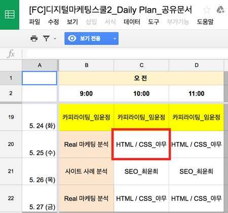
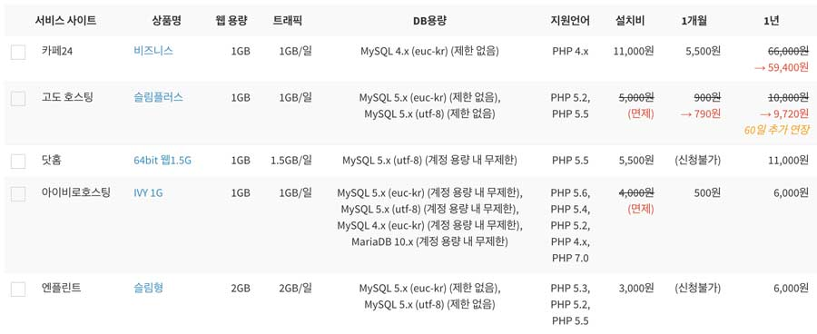

###### DMS(Digital Marketing School), Fast Campus
# Front-End Develop Course ─ DAY 03

<!-- ### 0. 테스트

- [디마스 『 프론트엔드 웹 3일차 』 TEST]()
- [TEST 답안]()

- -->

### 0. 수강생 피드백

###### 의견 1.

툴에 관한 설명이 너무 긴 것 같습니다. 차라리 강사님이 사용하시던 태그 들을 한꺼 번에 설치된 파일을 다운받아 사용하는 건 어떨까 싶습니다.

> 도구 사용법에 대한 것은 커리큘럼에 없었습니다. 수업 진행 시 사용되는 도구 사용법 중 궁금한 점은 수업에 방해되지 않게 쉬는 시간에 문의주시길 바랍니다.
자세한 도구 사용법은 [온라인 강의](https://www.inflearn.com/course/sublime-text-3-%EB%A7%88%EC%8A%A4%ED%84%B0%EB%A7%81-%EC%BD%94%EC%8A%A4/)를 통해 공부해보세요.
그리고 제가 사용하는 태그라는 것이...? 플러그인이 모두 설치된 도구를 말하시는 건가요? 이미 설치된 도구가 없어 죄송하게도 제공이 어려울 듯 합니다. ^~^;

-

###### 의견 2.

역시나 어렵습니다........... 기본적인 코딩 자체는 알고 있는데 들을수록 잘 모르겠는 부분이 많아서 따라가기 힘들었네요. 사실상 워드프레스로 작업을 하면 글쓸 때는 이미 갖춰있는 에디터를 쓸텐데... HTML로 입력을 하고 그걸 TEXT로 보면서 설명해주시는 방법을 예상했었거든요. 애초부터 TEXT로 작성을 해서 HTML을 바꾸려니 마음에 들지 않습니다. 그리고 워드프레스 글 쓰고 꾸미는건 어느정도 아는데 나중에 테마를 바꾸거나 레이아웃을 바꾸거나 유용한 플러그인 까는 부분도 알려주시는거 맞죠? 워드프레스 미디어 운영 수업에서 테마 고르는 법을 정확히 알려주질 않아서 그 부분도 좀 알고 싶은데 당장 다음시간에 서버를 깔게되면 어떻게 되는건지요.. 복습할 내용이 많을거 같네요.

> 과정 스케줄 표를 보면 `HTML`/`CSS`를 공부하는 과정(워드프레스 테마 수정을 위한)인데 워드프레스가 주인공인 과정으로 변질된 듯 합니다. 물론 수업 때 워드프레스를 다루긴 하지만, 워드프레스가 『주』이고 `HTML`/`CSS`가 『보조』가 된 듯 하네요. (그리고 안타깝게도 마음에 들지 않는 수업을 진행하고 있어 죄송합니다) 참고로 테마를 변경하여 레이아웃을 바꾸기 위해서는 `HTML`/`CSS`/`Javascript` 작성 능력이 있어야 합니다. 제공되는 무료 또는 유료 테마에 전적으로 의지해서는 원하는 디자인을 얻을 수 없습니다. 1기 분들이 왜? 유료 테마를 설치했음에도 불구하고 `HTML`/`CSS` 공부에 열심히 했는지 언젠가는 알게 되겠지요. 그리고 말씀주신 테마를 고르는 방법 또는 유용한 플러그인은 수업 시간에 다루도록 하겠습니다.



-

###### 의견 3.

음.. 좀 더 워드프레스와 연계가 더 깊은 부분이면 좋을 것 같습니다. 금일 교육 내용은 개인 문제 해결을 위한 1:1교습, 원론적인 태그 사용법, 그리고 툴 사용법에 치우쳤는데, 실제로 워드프레스 사용 때 얼마나 도움이 될 지 모르겠습니다. 다음주에 블로그 개설하면 훨씬 도움 되겠죠?

> 원론적인 `HTML` 사용법이라 말씀주셨는데.. 원론적이라는 것의 의미는 '근본(사물의 본질이나 본바탕)'을 말하는 것이죠. 맞습니다. 이 과정에서 배우는 것은 그 '근본'을 배우는 것입니다. 실제로 워드프레스를 사용할 때 얼마나 도움이 될 지 모르겠다고 이야기 주셨는데... 워드프레스를 차차 사용해보면 어떤 도움이 될지 알게 되실 듯 합니다. ^0^ 아래 글은 근본의 중요성에 대한 이야기입니다. 관심있게 읽어주셨으면 하네요.

-

현장에서 일하다 보면 경험으로 기술을 익힌 사람들(실기)이 규칙(이론)을 무시하는 경우를 종종 봅니다. 또 후배에게 일을 가르치다 보면 지루한 이론은 제쳐두고 막바로 실기를 배우고 싶어하는 친구들이 있습니다.
드럼을 배우려는 사람이 음악 이론은 무시하고 곧바로 채를 들고 드럼을 두드리고 싶어하는 것처럼 말입니다.

어깨 너머로 프로그램을 배워 편집 일을 하는 분이 계신데, 아무리 감각이 뛰어나도 자신의 경험치, 그 이상은 나오지 않습니다. 이론을 배우지 않으면 아마추어 수준을 벗어날 수 없다고 생각합니다.

‘한계’ 상황에 부딪혔을 때, 그것을 뛰어넘을 수 있는 힘은 규칙(이론)에서 온다고 봅니다. “규칙을 알아야 그 규칙을 파괴할 수도 있다”는 말, 어떤 분야를 마스터 하고 싶다면, 한계를 뛰어넘어 새로운 단계로 도약하고 싶다면, 꼭 새겨 들어야 할 말이 아닌가 싶습니다.

**규칙을 전부 마스터하면 뭐든지 할 수 있다.**<br>
**심지어 규칙을 파괴할 수도 있다.**<br>
**그런데 체계가 아예 없으면 시작조차 할 수 없다.**<br>
― 에드 펠라 (Ed Fella)


-

###### 의견 4.

html, css 의 스킬 하나씩 알려주시고 또 다른 스킬로 넘어 갈때 방금 가르쳐주신 스킬을 주석으로 넘기지 마세요 ㅠㅠ 나중에 볼때 뭔지 하나도 모르겠습니다...그대로 둬주세요…

> "주석으로 넘기다는 것의 의미"가 "주석 처리하지 말고 그냥 놔두라는 것"으로 판단됩니다. 가급적 `HTML`/`CSS` 수업 중 주석 처리를 하지 않도록 하겠습니다. 혹시 주석 처리를 하게 되면 의견을 주시길 바랍니다. ^ㅡ^

---

### 1. 워드프레스(Wordpress) 설치, 호스트/도메인, FTP

-

#### 1-0. 워드프레스란?


**오픈소스 콘텐츠 매니지먼트 시스템(CMS: Content Management System)**.<br>웹 사이트 콘텐츠를 발행, 편집, 수정하고 이를 관리하기 위한 시스템을 말한다.
워드프레스는 오픈소스로 소스코드 공개, 이를 활용한 변형까지 가능한 자유를 보장한다. 요컨대 자유롭게 워드프레스를 가져다 변형하여 사용해도 저작권에 문제가 없다는 이야기이다.

웹사이트를 개발하게 되면 관리를 위한 관리자 페이지가 필요하다.

웹 서비스 영역은 크게 2가지 영역으로 갈리는데 하나는 사용자와 대면하여 콘텐츠를 보여주는 콘텐츠 영역,
다른 하나는 웹 사이트를 관리할 수 있는 관리 영역이다.

- 콘텐츠 영역: Front-End
- 관리 영역: Back-End

-

###### ※ 워드프레스 개발에 요구되는 지식

> 워드프레스는 콘텐츠와 관리 모두 제어가 가능한 시스템으로 PHP 서버 개발 언어와 MySQL 데이터베이스 관리 툴로 만들어 졌다.
워드프레스를 사용자 입맛에 맞게 개발/변경 하려면 Front-End, Back-End 전문 지식을 요구한다. Front-End 전문 지식은
`HTML`, `CSS`, `Javascript`를 다루는 능력을 말하며, Back-End 전문 지식은 `PHP`, `MySQL` 등을 다룰 수 있는 능력을 말한다.

디지털 마케팅 스쿨은 개발자를 양성하는 과정이 아니다. 워드프레스를 활용할 수 있는 마케터로 거듭나면 된다. 문제는 워드프레스를 운영하는데 HTML, CSS 지식이 요구된다는 점.
단순하게 워드프레스 사용법만 알면 원하는 웹 서비스를 만들 수 있을 것이라고 생각하는가? DMS 2nd 프론트엔드 개발 강의(6일, 36시간)를 들었다고 해서 워드프레스를 원하는데로
모양 또는 기능을 개발할 수는 없다. 워드프레스를 설치하고 사용할 줄 안다고 해서 테마 개발을 할 수 있는 것은 아니다.

-

###### 워드프레스의 10가지 특징

1. 웹 표준에 기반한 디자인(설계)
1. 편리한 페이지/포스트 만들기
1. 테마(Theme) 기반
1. 다른 블로그 서비스와 커뮤니케이션(트래픽/핑백)
1. 댓글 달기
1. 스팸 방지
1. 회원 관리 시스템 (10단계)
1. 포스트 비밀번호 관리
1. 손쉬운 설치 및 업그레이드
1. 손쉬운 데이터 이전

-

#### 1-1. 워드프레스 로컬 설치

워드프레스는 설치하면 바로 사용 가능한 프로그램이지만, 정적(Statc) 콘텐츠가 아닌 데이터베이스와 연동하여 원하는 데이터를 불러와 처리하는 동적(Dynamic) 콘텐츠를 생성하는 PHP 프로그램이다. PHP 언어는 서버 환경에서만 동작하므로 워드프레스를 공부하기 위해 웹 호스팅 서비스를 신청해야 한다. 하지만 워드프레스를 사용하는 방법을 모른 채 웹 호스팅을 신청하는 것은 미련한 짓이다. 먼저 워드프레스 사용법을 공부한 후 웹 호스팅 신청하는 것이 현명한 방법이다.

워드프레스를 로컬 서버(내 컴퓨터)에 설치하여 사용하면 실제 웹 호스팅 서버보다 빠르고 제어도 손쉬워 공부하기 쉽다. 우리는 먼저 컴퓨터를 서버로 구동하게 하는 프로그램을 설치한 다음 워드프레스를 설치해볼 것이다. 워드프레스를 설치하기 위한 환경은 다음의 것으로 구성되어야 한다.

- Apache Server (웹 서버 서비스)
- PHP (서버 스크립트 언어)
- MySQL (데이터를 저장하는 공간을 관리하는 프로그램)

-

하지만 요구되는 3가지를 설치하는 과정은 매우 번거로우므로 사용자 편의를 위해 3가지 프로그램을 번들(Bundle, 병합)한 프로그램을 설치하는 것이 좋다. 이를 사용하면 설치 한 번으로 바로 서버 환경 구성이 가능하다.

##### 로컬 서버 테스트 도구
- [MAMP for Windows/Mac OSX](https://www.mamp.info/en/downloads/)
- [Autoset for Windows](http://autoset.net/xe/) `※ MAMP를 사용한 Wordpress 설치 오류 발생시 대체 사용`
- [Autoset을 활용한 Wordpress 설치 영상](assets/install-wordpress-autoset-windows.mp4)

##### 워드프레스 설치 파일 다운로드
- [Wordpress](https://ko.wordpress.org/)

-

##### `wordpress/wp-config.php` 파일

###### 워드프레스 설치 시, 입력되어야 할 정보

```php
// ** MySQL 설정 - 웹 호스트로부터 정보를 얻어 입력 ** //
/** 워드프레스 데이터베이스 이름 */
define('DB_NAME', 'wordpress');

/** MySQL 데이터베이스 사용자 이름  */
define('DB_USER', 'root');

/** MySQL 데이터베이스 패스워드 */
define('DB_PASSWORD', 'root');

/** MySQL 호스트 이름 */
define('DB_HOST', 'localhost');

/** 데이터베이스 테이블에서 사용되는 언어 인코딩 설정 */
define('DB_CHARSET', 'utf8mb4');

/** The Database Collate type. Don't change this if in doubt. */
define('DB_COLLATE', '');
```

###### 워드프레스 인증키, 솔트(암호 코드) 변경

인증키, 솔트(암호 코드)는 처음 설치할 때 자동으로 만들어지므로 설정할 필요는 없지만, 자주 변경해줘야 해킹을 방지할 수 있다.

[솔트 코드 암호화 문자열 만들기](https://api.wordpress.org/secret-key/1.1/salt/)

```php
/**#@+
 * Authentication Unique Keys and Salts.
 *
 * Change these to different unique phrases!
 * You can generate these using the {@link https://api.wordpress.org/secret-key/1.1/salt/ WordPress.org secret-key service}
 * You can change these at any point in time to invalidate all existing cookies. This will force all users to have to log in again.
 *
 * @since 2.6.0
 */
define('AUTH_KEY',         'N,#A356b_r.atXe$>!USUgt%mW^!}Uf2kVR?zz:<UCF9e;d%91SV<e^,%9Nfebt*');
define('SECURE_AUTH_KEY',  'Yz @%f|HxH~x1_;|S $HDCO|^,OBf|iDwi2UZDKc1U9E~nol|;&T_`[!s6G#*QHl');
define('LOGGED_IN_KEY',    'A-wP@BX:0k,+GaUm=$(dkb#=qI}tued+@a3VQ$,rLaEZ[2mZGWO!R=n<T@j*p~N2');
define('NONCE_KEY',        'eU=Bj2WQ07,`e#t1jts-%| r)<-1E1.pv;)F;xTK5`s=ZFoEr:7=P:;e+[.0~l?q');
define('AUTH_SALT',        'JEAvBZO-]PJm9U/L=7$M;3tsOxtw v 8[ym9S:37esY/ok(R/?xvR|KZ,#-n.I)X');
define('SECURE_AUTH_SALT', 'M+peImy742_y8YBz3}<=PJ@qd!H4#LMq+G`@YbKm$<aH_n/v6PRW(n?4iP+RhwS1');
define('LOGGED_IN_SALT',   '@sjPe&U*a`dl7tp KD%%JXDYotmP[ {.+l*FD+Rr3/WGQgGMuXC,:AVY#+`:)%qQ');
define('NONCE_SALT',       'L9Zd}.hae$pQzS9m5X`4{!1+h|^%OWw]~RRY?uE=1w-V;faZje}:igI64zy`bJ2&');

/**#@-*/
```

-

###### 워드프레스 디버깅 모드 활성화

`WP_DEBUG` 모드를 `true`로 설정하면 오류를 감지하여 분석하기 용이하다. (개발자 모드)

```php
/**
 * For developers: WordPress debugging mode.
 *
 * Change this to true to enable the display of notices during development.
 * It is strongly recommended that plugin and theme developers use WP_DEBUG
 * in their development environments.
 *
 * For information on other constants that can be used for debugging,
 * visit the Codex.
 *
 * @link https://codex.wordpress.org/Debugging_in_WordPress
 */
define('WP_DEBUG', true);
```

---

#### 1-2. 워드프레스 호스팅 설치

##### 호스팅이란?

네트웍에 연결되어 있는 컴퓨터들을 호스트라고 한다.

온라인 서버의 일정 공간을 빌려서 내가 원하는 서비스를 할 수 있게 해주는 것.
개인이 웹 서버를 운영하는것은 사실 비용도 비용이거니와 거의 불가능.
그래서 일정 공간만 빌려서 사용을 하는 것을 웹호스팅이라고 한다.

###### 살펴볼 항목

- 웹 용량
- DB(Database, 데이터베이스) 용량
- 트래픽(Traffic)/일
- PHP 버전
- MySQL 버전
- 1년간 이용료

트래픽이나 하드 용량이 모자랄 경우 서서히 필요한 만큼만 늘려 나가는걸 추천.
물론 처음부터 큰 용량과 트래픽으로 시작해도 상관은 없지만, 처음부터 큰 용량과 트래픽이 필요하지 않다.
서비스를 사용하다 용량이 부족한 경우, 상위 서비스로 변경이 가능. 다만 하위 서비스로의 변경은 불가능.

-

##### 무료 호스팅

- [hostinger.kr](http://www.hostinger.kr/web-hosting)

-

##### 유료 호스팅

- [sansting.com](http://www.sansting.com/) - 내게 맞는 웹호스팅 환경을 이제 쉽게 찾으세요.



-

##### 유/무료 호스팅 비교

- [웹호스팅 무료호스팅 서비스 비교 (국내+외국)](http://nine8007.tistory.com/entry/%EB%AC%B4%EB%A3%8C%ED%98%B8%EC%8A%A4%ED%8C%85-%EC%97%85%EC%B2%B4-%EB%B0%8F-%EC%84%9C%EB%B9%84%EC%8A%A4-%EB%B9%84%EA%B5%90-%EA%B5%AD%EB%82%B4-%EC%99%B8%EA%B5%AD)
- [해외무료호스팅 vs 카페24](http://gganuslab.com/free-hosting-vs-cafe24/)

###### 요약

- **해외 호스팅**은 **무료**로 제공되는 서비스가 뛰어나나, **속도가 느리다**.
- hostinger.kr 서비스의 경우, 운영하는 웹사이트가 서버 CPU의 20% 이상을 사용하면<br>24시간 동안 사이트가 차단됨. (사진,동영상 서비스는 무리)
- 결론! **지속적이고 안정적이고 빠른 서비스를 하고자 맘 먹었다면, 유료 호스팅 서비스를 사용할 것을 권장**.

---

#### 1-3. 도메인

##### IP란?

인터넷에 연결되어 있는 장치(컴퓨터/스마트폰/타블릿/서버 등)는 각각의 장치를 식별할 수 있는 주소를 가지고 있는데 이를 ip라고 한다.<br>예) `127.120.24.99`, `192.168.0.1`

##### 도메인이란?

[도메인](http://krnic.or.kr/jsp/resources/domainInfo/domainInfo.jsp)은 인터넷에 연결된 컴퓨터를 사람이 쉽게 기억하고 입력할 수 있도록 문자(영문, 한글 등)로 만든 인터넷주소.
법률상으로는 인터넷 주소 자원에 관한 법률 제 2조에 따라 도메인은 인터넷에서 인터넷 프로토콜 주소를 사람이 기억하기 쉽도록 하기 위하여 만들어진 것.

IP는 사람이 이해하고 기억하기 어렵기 때문에 이를 위해서 각 IP에 이름을 부여할 수 있게 했는데, 이것을 도메인이라고 한다.

##### 도메인 구매 참고 자료

- [.kr 도메인 등록비 비교 사이트](http://blog.nullfree.kr/3)
- [.com/.net/.org 도메인 등록비 가격비교 (국내업체편)](http://blog.nullfree.kr/4)
- [등록 대행자 및 수수료 서비스](http://domain.nida.or.kr/jsp/popup/agencyFeePop.jsp)

##### 도메인 구매 시 호스트에 연결

1. 도메인 관리 페이지 접속
1. 호스트 관리 또는 포워딩 관리 페이지 접속
1. 웹 호스팅 업체로부터 IP 주소를 확인

---

#### 1-4. FTP

##### FTP란?

파일 전송 프로토콜(File Transfer Protocol).<br>
HTTP가 웹을 해석하고 전달하기 위한 프로토콜인 것처럼 FTP는 파일을 주고 받기 위해서 필요한 프로토콜.

FTP 서버(21 포트 사용)에 파일을 올리기 위해서는 서버에 접속할 수 있는 프로그램이 필요한데 이를 FTP 클라이언트라고 한다.

- FTP Server (Port 21)
- FTP Client

-

##### FTP 클라이언트 도구

- [Filezilla](https://filezilla-project.org/)

---

### 2. 워드프레스 기본 사용법

-

#### 2-1. 알림판(대시보드, Dashboard)

워드프레스 관리자 페이지로 관리 영역(백엔드, Back-End)이다. 자세한 소개는 수업 시간에 실습한다.

※ 워드프레스 관리자 페이지 로그인 창으로 이동하려면 도메인 주소 뒤에 `wp-admin`을 붙인 후 접속한다.

`http://www.yourdomain.com/wp-admin`

-

###### 하위 폴더에 설치된 워드프레스 주소를 루트 경로에서 실행하는 방법

**STEP 01**

`wordpress/index.php` 파일을 `/` 서버 루트 경로로 복사한 후, 아래와 같이 수정하고 서버를 재 실행한다.

※ `/index.php` 파일을 열어 `/{wordpress-폴더}/wp-blog-header.php`로 변경.

```php
<?php
/**
 * Front to the WordPress application. This file doesn't do anything, but loads
 * wp-blog-header.php which does and tells WordPress to load the theme.
 *
 * @package WordPress
 */

/**
 * Tells WordPress to load the WordPress theme and output it.
 *
 * @var bool
 */
define('WP_USE_THEMES', true);

/** Loads the WordPress Environment and Template */
require( dirname( __FILE__ ) . '/wordpress/wp-blog-header.php' );
```

-

**STEP 02**

`설정` 페이지에서 `사이트 주소(URL)` 수정

`http://localhost:8888/wordpress` → `http://localhost:8888/`

-

**STEP 03**

기본 고유주소 설정 형식을 사용하지 않을 경우 아래와 같이 수정.

`/` 서버 루트 경로에 `.htaccess` 파일 생성 후 `RewriteBase` 값에 워드프레스 폴더 이름 추가.

```sh
# BEGIN WorPpress
<IfModule mod_rewrite.c>
RewriteEngine On
RewriteBase /wordpress/
RewriteRule ^index\.php$ - [L]
RewriteCond %{REQUEST_FILENAME} !-f
RewriteCond %{REQUEST_FILENAME} !-d
RewriteRule . /index.php [L]
</IfModule>
# END WorPpress
```

<!-- http://kopress.kr/blog/kb/%EA%B4%80%EB%A6%AC%EC%9E%90-%ED%99%94%EB%A9%B4-%EC%82%B4%ED%8E%B4%EB%B3%B4%EA%B8%B0/ -->

-

#### 2-2. 글(포스트, Post)

글(Post)을 쓰는 기본적인 방법은 제목을 입력한 후, 내용을 기술하는 것이다. 내용은 글과 링크, 이미지, 표 등으로 구성된다.
뿐만 아니라 고유주소(Permalink), 글 형식, 카테고리, 태그, 특성 이미지 등을 다뤄본다. 자세한 사용법은 실습을 통해 익혀보자.

※ 고유주소 설정은 `설정` > `고유주소`에서 변경한다. (한 번 바꾼 내용을 그대로 유지하는게 좋으므로 신중을 가해 결정한다)

※ 한글 웹 폰트를 사용하려면 `wp-content/themes/{테마폴더}/header.php` 파일에 웹 폰트 링크 코드를 삽입해야 한다. 웹 폰트 스타일 적용은 `wp-content/themes/{테마폴더}/style.css` 파일을 수정해야 한다.

```php
<?php
/**
 * The template for displaying the header
 *
 * Displays all of the head element and everything up until the "site-content" div.
 *
 * @package WordPress
 * @subpackage Twenty_Sixteen
 * @since Twenty Sixteen 1.0
 */

?><!DOCTYPE html>
<html <?php language_attributes(); ?> class="no-js">
<head>
  <meta charset="<?php bloginfo( 'charset' ); ?>">
  <meta name="viewport" content="width=device-width, initial-scale=1">
  <!-- 한글 웹 폰트 코드 삽입 -->
  <link href="//spoqa.github.io/spoqa-han-sans/css/SpoqaHanSans-kr.css" rel="stylesheet">
```

```css
/**
 * 3.0 - Typography
 */

body,
button,
input,
select,
textarea {
  color: #1a1a1a;
  /* 테마의 기본 글꼴 설정 */
  /*font-family: Merriweather, Georgia, serif;*/
  /* 한글 웹폰트 글꼴 사용을 명시 */
  font-family: "Spoqa Han Sans", sans-serif;
  font-size: 16px;
  font-size: 1rem;
  line-height: 1.75;
}
```

-

#### 2-3. 페이지(Page)

페이지는 포스트(글)와 성향이 다르다. 포스트와 달리 페이지는 내용이 변경되지 않는다. 반면 포스트는 시간에 따라 내용이 변경된다. 쉽게 생각해 포스트는 블로그의 글이라고 볼 때, 페이지는 기업의 각 페이지를 연상해보면 이해가 쉽다. 그리고 블로그는 댓글을 달 수 있지만, 페이지는 댓글을 달지 못하고 카테고리/태그에 연결되지 않는다. 실습을 통해 차이를 확인하자.

-

#### 2-4. 댓글(Comments)

댓글이 많아지면 관리가 필요하다. 뿐만 아니라 스팸 또한 댓글로 등록되므로 스팸 관리 플러그인을 설치해 스캠 댓글을 방지해본다.

-

#### 2-5. 외모(Appearance)

테마, 위젯, 메뉴, 테마 편집기 등을 제공한다. 자세한 사용법은 실습을 통해 익혀본다.

-

#### 2-6. 플러그인(Plug-in)

워드프레스를 보다 강력하게 만들어 줄 새로운 기능을 추가할 수 있다. 필요한 기능을 검색하여 워드프레스에 기능을 추가해보자.

-

#### 2-7. 사용자(Users)

워드프레스는 다양한 사용자가 함께 사용할 수 있어 관리 계층 별 권한을 설정할 수 있다.

-

#### 2-8. 도구(Tools)

워드프레스 데이터를 백업하거나, 백업된 데이터를 로드할 수 있다.

-

#### 2-9. 설정(Settings)

워드프레스 도구를 사용하기 위한 설정 관리는 이 곳에서 이루어진다.

---

### 3. 워드프레스 테마

자신만의 웹사이트를 제작하는 것은 고도화된 전문 지식을 요구합니다. 하지만 워드프레스에서는 누구나 손쉽게 웹사이트를 만들 수 있도록 테마를 지원한다. 개발자가 만든 테마를 자신의 워드프레스에 설치하는 것만으로도 웹사이트 모양(Appearance)이 갖춰지기 때문. 테마는 종류가 워낙 다양하기 때문에 자신이 하고자 하는 서비스에 적합한 유형의 테마를 선택할 필요가 있다. 문제는 적절한 테마를 선택하는 것만으로 100% 자신이 원하는 모양을 갖출 수 없다는 것이다. HTML/CSS에 대한 지식이 없다면 원하는 모양을 만들 수 없다. 뿐만 아니라 관리자 페이지에 기본 지원되지 않는 기능을 제공하려면 PHP를 다룰 수 있어야 한다.

- [Wordpress 무료 테마](http://wordpress.org/extend/themes/)
- [Wordpress 유료 테마](https://wordpress.org/themes/commercial/)
  - [Theme Forest](http://themeforest.net/category/wordpress)
  - [Woothemes](http://www.woothemes.com/)
  - [Elegant Theme](http://www.eleganthemes.com/)

-

###### 참고하여 읽어보기

- [Wordpress 테마 이해하기](http://kopress.kr/blog/kb/%ED%85%8C%EB%A7%88-%EC%9D%B4%ED%95%B4%ED%95%98%EA%B8%B0/)
- [Wordpress 테마/템플릿 구조](http://kopress.kr/blog/kb/%ED%85%8C%EB%A7%88-%ED%85%9C%ED%94%8C%EB%A6%BF-%EA%B5%AC%EC%A1%B0/)

-

#### 3-1. 커스텀 테마 설치

1. [인기 테마](https://wordpress.org/themes/browse/popular/) 페이지에서 마음에 드는 테마를 하나 다운로드 받는다.
1. 다운 받은 테마 ZIP 파일 압축을 푼다.
1. 워드프레스 서비스 폴더에서 `wordpress/wp-content/themes/` 경로르 찾아 테마 폴더를 붙여 넣는다.
1. 워드프레스 `관리자 페이지` > `외모`로 이동한 후, 설치한 테마를 활성화한다.

-

#### 3-2. 테마 선택의 기준

1. **서비스의 성격 (주제 고려)**
  - 블로그
  - 기업 사이트
  - 쇼핑몰
  - 커뮤니티
1. **무료/유료 서비스 개발 적합성**
  - 무료
    1. 무료라 접근성이 용이해 다른 사람들도 사용할 가능성이 있어 개성이 떨어진다.
    1. 무료이나, 원하는 기능이 제공되지 않아 개발 비용이 필요하다.
    1. 디자인이 고급스럽지 못하다.
  - 유료
    1. 테마를 개발할 능력이 없으면 유료를 사용하는 것이 좋다.
    1. 유료이나, 원하는 기능을 가진 테마를 구매하면 개발 비용을 줄일 수 있다. (커스터마이징 개발 비용은 듬)
1. **테마에 포함된 기능**
  - 무료와 달리, 유료 테마를 구매할 경우는 포함된 기능을 파악할 필요가 있다.
  - 원하는 기능이 포함되어 있는지 유무를 고려할 필요가 있다.
1. **레이아웃**
  - 레이아웃의 자유도가 높은 테마를 선택하는 것이 좋다.
    1. 1단 레이아웃 - 이미지를 주로 사용하는 사이트 디자인
    1. 2,3단 레이아웃 - 글을 위주로 하는 사이트 디자인
1. **브라우저 히위 호환성 지원 여부**
  - 국내와 달리 해외 워드프레스 테마는 IE 하위 버전을 지원하지 않음.
  - 테마를 선택할 때 IE 하위 브라우저 호환성을 필히 체크할 것.

-

#### 3-3. 차일드 테마

차일드 테마는 본 테마(부모)를 확장하여 테마의 스타일 또는 기능 등을 덮어쓸 수 있다. 다음의 경우 사용한다.

- 테마 업데이트에 따른 기존 설정 제거 방지
- 워드프레스 테마 구조 이해에 도움
- 빠른 디자인/개발 가능

-

###### 차일드 테마 제작 방법

1. `테마이름-child` 폴더를 `wp-content/themes/` 안에 생성
1. `style.css`, `functions.php` 파일 생성

**style.css**

```css
/*
Theme Name:     [필수] 차일드 테마 이름
Theme URI:      [선택] 테마 위치 예) http://example.com/
Description:    [선택] 차일드 테마 설명
Author:         [선택] 테마 개발자 이름
Author URI:     [선택] 개발자 웹사이트 주소 예) http: //example.com/about/
Template:       [필수] 부모 테마 이름 (대소문자 구분)
Version:        [선택] 차일드 테마 개발 버전 예) 0.1.0
*/

/* 부모 테마 스타일 로드가 요구될 경우 */
@import "../부모테마폴더/style.css";
```

-

**functions.php**

style.css와는 달리, Child 테마의 functions.php는 Parent 를 오버라이드(덮어쓰기)하지 않습니다.
대신, Parent 의 functions.php 가 함께 로드됩니다. (특히, 그것은 Parent 파일로 로드 되기 전 입니다)

```php
<? php
# 함수 정의
function theme_enqueue_styles() {
  $parent_style = 'parent-style';
  wp_enqueue_style( $parent_style, get_template_directory_uri() . '/style.css' );
  wp_enqueue_style( 'child-style', get_stylesheet_uri() . '/style.css', array( $parent_style ) );
}
# 함수 호출
add_action('wp_enqueue_scripts', 'theme_enqueue_styles');
```

-

###### 참고

- [Child Themes](http://codex.wordpress.org/Child_Themes)
- [ko:Child Themes](http://codex.wordpress.org/ko:Child_Themes)

<!-- http://kopress.kr/blog/kb/child-theme/ -->

-

### 4. 플러그인

[인기 플러그인](https://wordpress.org/plugins/browse/popular/)을 검토하여 적절한 플러그인을 설치하여 워드프레스에 기능을 추가한다.

-

#### 추천 플러그인 목록

- **보안**
  - [Akismet](https://wordpress.org/plugins/akismet/)<br>
  스팸 관리 플러그인으로 [API Key](https://akismet.com/wordpress/)를 발급받아 사용한다.
  - [Rename wp-login.php](https://wordpress.org/plugins/rename-wp-login/)<br>
  워드프레스를 사용해본 사람이라면 누구나 알 수 있는 `도메인/wp-admin`으로 관리자 페이지에 접근할 수 없도록 변경해준다.

- **편집 기능 강화**
  - [Beaver Builder plugin](https://wordpress.org/plugins/beaver-builder-lite-version/)<br>
  페이지 빌더 플러그인으로 손쉽게 페이지를 제작해준다.
  - [Page Builder by SiteOrigin](https://wordpress.org/plugins/siteorigin-panels/)<br>
  페이지 빌더 플러그인으로 손쉽게 페이지를 제작해준다.
  - [Black Studio TinyMCE Widget](https://wordpress.org/plugins/black-studio-tinymce-widget/)<br>
  비주얼 에디터를 위젯에 추가해준다.
  - [Visual Composer(유료)](http://codecanyon.net/item/visual-composer-page-builder-for-wordpress/242431)<br>
  페이지 빌더 플러그인으로 손쉽게 페이지를 제작해준다.
  - [ConvertPlug(유료)](http://codecanyon.net/item/convertplug-wordpress-popups-plugin/14058953?clickthrough_id=723626107&redirect_back=true&ref=terranhax&s_phrase=&s_rank=60)

- **성능 향상**
  - [A2 Optimized WP](https://wordpress.org/plugins/a2-optimized-wp/)
  - [EWWW Image Optimizer](https://wordpress.org/plugins/ewww-image-optimizer/)
  - [W3 Total Cache](https://wordpress.org/plugins/w3-total-cache/)

- **차일드 테마**
  - [One-Click Child Theme](https://wordpress.org/plugins/one-click-child-theme/)<br>
  차일드 테마를 1회 클릭으로 설정해준다.
  - [Child Theme Configurator](https://wordpress.org/plugins/child-theme-configurator/)<br>
  차일드 테마 설정을 손쉽게 처리해준다.

<!-- http://www.childthemeconfigurator.com/tutorial-videos/ -->

- **기타**
  - [Jetpack by WordPress.com](https://wordpress.org/plugins/jetpack/)<br>
  워드프레스 플러그인 모음으로 사이트 모양과 기능을 사용자 정의할 수 있는 다양한 기능을 제공한다. ([Wordpress.com](http://Wordpress.com) 가입해야 사용 가능)
  - [Title Remover](https://wordpress.org/plugins/title-remover/)<br>
  페이지의 타이틀을 제거해준다.
  - [Simple Lightbox](https://wordpress.org/plugins/simple-lightbox/)<br>
  이미지 라이트박스를 적용하는 플러그인이다.
  - [Contact Form 7](https://wordpress.org/plugins/contact-form-7/)<br>
  폼을 손쉽게 붙여주는 플러그인이다.
  - [Social Media Widget](https://wordpress.org/plugins/social-media-widget/)<br>
  SNS를 손쉽게 연결해주는 플러그인이다.
  - [WP Google Fonts](https://wordpress.org/plugins/wp-google-fonts/)<br>
  Google 웹폰트 사용을 손쉽게 만들어 준다.

<!-- http://ssamture.net/archives/2924 -->

---

### 5. Wordpress 웹 사이트 제작 DEMO

-

#### 5-1. 테마 설치

1. [`Sydney` Theme](http://athemes.com/theme/sydney/) 설치
1. 차일드 테마 추가
1. 차일드 테마 활성화

-

#### 5-2. 페이지 추가

- Home
- Products
- Services
- Gallery
- Blog
- Contact

-

#### 5-3. 메뉴 설정

- 메뉴 이름: `GNB`
- 테마 위치: `Primary Menu`

-

#### 5-4. 사용자 정의

- `Site title/tagline/logo` 설정

###### Photoshop이 없는 사용자에게 필요한 도구

- [Pixlr, 온라인 포토 그래픽 도구](https://pixlr.com/)
- [logomakr, 온라인 로고 제작 도구](http://logomakr.com/)

-

#### 5-5. 프론트 페이지 설정

- `정적인 전면 페이지` 설정
- `Header Slider` 설정

-

#### 5-6. 푸터 설정

- `Footer` > `Footer Widget Area` 설정

**Footer 1. 로고/회사 정보**

- `비주얼 편집기` 설정 (Black Studio TinyMCE Widget 플러그인 설치)

```html
Company: &copy; Digital Marketer
CEO: OOO
Corperate Number: OOO-OO-OOOOO
Address: OO STREET APT #3F, WOODSIDE, NY 11377

<!-- 상호명: (주) Digital Marketer -->
<!-- 대표자: OOO -->
<!-- 사업자 번호: OOO-OO-OOOOO -->
<!-- 서울시 강남구 역삼동 OOO -->
```

**Footer 2. 고객센터 정보**

- `비주얼 편집기` 설정

```html
Call Center
10:00 ~ 17:00 / LUNCH. 12:00 ~ 13:00
SAT , SUN , HOLIDAY OFF

<!-- 고객센터 -->
<!-- 02) 0000-0000 -->
<!-- 평일 오전 9시 - 오후 6시 -->
<!-- 주말 오전 9시 - 오후 12시 -->
```

**Footer 3. 카테고리**

- `카테고리` 설정 (기본)

**Footer 4. 소셜미디어**

- `Social Media Icons` 설정 (Jetpack 플러그인 설치)

-

#### 5-7. 테마 편집

`외모` > `테마 편집`

```css
.footer-widgets { padding: 30px 0; }
```

-

#### 5-8. 제품 페이지 작성

- `Header Area` > `헤더 이미지` 설정
- 페이지 헤더 감춤 (Title Remover 플러그인 설치)
- 페이지 템플릿: Full Width로 설정
- `Page Builder` 실행 (Beaver Builder plugin 플러그인 설치), [Amazon Products](https://www.amazon.com/ref=nav_logo)

-

#### 5-9. 서비스 페이지 작성

- 페이지 헤더 감춤
- 3단 컬럼 (이미지 + 텍스트 구성)
- 1단 컬럼: 서비스 설명 글
- Youtube 비디오 추가

-

#### 5-10. 갤러리 페이지 작성

- 페이지 헤더 감춤
- 기본 템플릿 사용
- 이미지 갤러리 생성 (타일 모자이크 활성화)
- 이미지 클릭 시 라이트 박스 동작 (Simple Lightbox 플러그인 설치)

-

#### 5-11. 블로그 페이지 작성

- 다수의 블로그 글 추가 (태그, 카테고리 포함)
- `외모` > `사용자 정의하기` > `Blog Options` > `Masonry` 모드로 변경

-

#### 5-12. 사이드 바 설정

- `외모` > `위젯` > `Sidebar` 설정

-

#### 5-13. 컨텍트 페이지 설정

- 페이지 헤더 감춤
- 페이지 템플릿: Full Width로 설정
- 2단 컬럼: 구글 지도 +

---

### 6. 유료 테마

- [Lecco](http://www.market-me.fr/lecco/)
- [Antonette](https://creativemarket.com/Creanncy/534649-30-Antonette-WordPress-Blog-Theme)
- [Sidefolio](https://dessign.net/side-folio-responsive-theme/)
- [Spesh](http://hezy.org/spesh/)