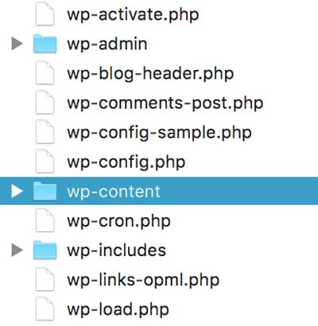
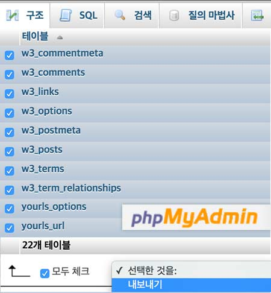

###### DMS(Digital Marketing School), Fast Campus
# Front-End Develop Course ─ DAY 04

### 4. 워드프레스 테마

자신만의 웹사이트를 제작하는 것은 고도화된 전문 지식을 요구합니다. 하지만 워드프레스에서는 누구나 손쉽게 웹사이트를 만들 수 있도록 테마를 지원한다. 개발자가 만든 테마를 자신의 워드프레스에 설치하는 것만으로도 웹사이트 모양(Appearance)이 갖춰지기 때문. 테마는 종류가 워낙 다양하기 때문에 자신이 하고자 하는 서비스에 적합한 유형의 테마를 선택할 필요가 있다. 문제는 적절한 테마를 선택하는 것만으로 100% 자신이 원하는 모양을 갖출 수 없다는 것이다. HTML/CSS에 대한 지식이 없다면 원하는 모양을 만들 수 없다. 뿐만 아니라 관리자 페이지에 기본 지원되지 않는 기능을 제공하려면 PHP를 다룰 수 있어야 한다.

- [Wordpress 무료 테마](http://wordpress.org/extend/themes/)
- [Wordpress 유료 테마](https://wordpress.org/themes/commercial/)
  - [Theme Forest](http://themeforest.net/category/wordpress)
  - [Woothemes](http://www.woothemes.com/)
  - [Elegant Theme](http://www.eleganthemes.com/)

-

###### 참고하여 읽어보기

- [Wordpress 테마 이해하기](http://kopress.kr/blog/kb/%ED%85%8C%EB%A7%88-%EC%9D%B4%ED%95%B4%ED%95%98%EA%B8%B0/)
- [Wordpress 테마/템플릿 구조](http://kopress.kr/blog/kb/%ED%85%8C%EB%A7%88-%ED%85%9C%ED%94%8C%EB%A6%BF-%EA%B5%AC%EC%A1%B0/)

-

#### 4-1. 커스텀 테마 설치

1. [인기 테마](https://wordpress.org/themes/browse/popular/) 페이지에서 마음에 드는 테마를 하나 다운로드 받는다.
1. 다운 받은 테마 ZIP 파일 압축을 푼다.
1. 워드프레스 서비스 폴더에서 `wordpress/wp-content/themes/` 경로르 찾아 테마 폴더를 붙여 넣는다.
1. 워드프레스 `관리자 페이지` > `외모`로 이동한 후, 설치한 테마를 활성화한다.

-

#### 4-2. 테마 선택의 기준

1. **서비스의 성격 (주제 고려)**
  - 블로그
  - 기업 사이트
  - 쇼핑몰
  - 커뮤니티
1. **무료/유료 서비스 개발 적합성**
  - 무료
    1. 무료라 접근성이 용이해 다른 사람들도 사용할 가능성이 있어 개성이 떨어진다.
    1. 무료이나, 원하는 기능이 제공되지 않아 개발 비용이 필요하다.
    1. 디자인이 고급스럽지 못하다.
  - 유료
    1. 테마를 개발할 능력이 없으면 유료를 사용하는 것이 좋다.
    1. 유료이나, 원하는 기능을 가진 테마를 구매하면 개발 비용을 줄일 수 있다. (커스터마이징 개발 비용은 듬)
1. **테마에 포함된 기능**
  - 무료와 달리, 유료 테마를 구매할 경우는 포함된 기능을 파악할 필요가 있다.
  - 원하는 기능이 포함되어 있는지 유무를 고려할 필요가 있다.
1. **레이아웃**
  - 레이아웃의 자유도가 높은 테마를 선택하는 것이 좋다.
    1. 1단 레이아웃 - 이미지를 주로 사용하는 사이트 디자인
    1. 2,3단 레이아웃 - 글을 위주로 하는 사이트 디자인
1. **브라우저 히위 호환성 지원 여부**
  - 국내와 달리 해외 워드프레스 테마는 IE 하위 버전을 지원하지 않음.
  - 테마를 선택할 때 IE 하위 브라우저 호환성을 필히 체크할 것.

-

#### 4-3. 차일드 테마

차일드 테마는 본 테마(부모)를 확장하여 테마의 스타일 또는 기능 등을 덮어쓸 수 있다. 다음의 경우 사용한다.

- 테마 업데이트에 따른 기존 설정 제거 방지
- 워드프레스 테마 구조 이해에 도움
- 빠른 디자인/개발 가능

-

###### 차일드 테마 제작 방법

1. `테마이름-child` 폴더를 `wp-content/themes/` 안에 생성
1. `style.css`, `functions.php` 파일 생성

**style.css**

```css
/*
Theme Name:     [필수] 차일드 테마 이름
Theme URI:      [선택] 테마 위치 예) http://example.com/
Description:    [선택] 차일드 테마 설명
Author:         [선택] 테마 개발자 이름
Author URI:     [선택] 개발자 웹사이트 주소 예) http: //example.com/about/
Template:       [필수] 부모 테마 이름 (대소문자 구분)
Version:        [선택] 차일드 테마 개발 버전 예) 0.1.0
*/

/* 부모 테마 스타일 로드가 요구될 경우 */
@import "../부모테마폴더/style.css";
```

-

**functions.php**

style.css와는 달리, Child 테마의 functions.php는 Parent 를 오버라이드(덮어쓰기)하지 않습니다.
대신, Parent 의 functions.php 가 함께 로드됩니다. (특히, 그것은 Parent 파일로 로드 되기 전 입니다)

```php
<? php
# 함수 정의
function theme_enqueue_styles() {
  $parent_style = 'parent-style';
  wp_enqueue_style( $parent_style, get_template_directory_uri() . '/style.css' );
  wp_enqueue_style( 'child-style', get_stylesheet_uri() . '/style.css', array( $parent_style ) );
}
# 함수 호출
add_action('wp_enqueue_scripts', 'theme_enqueue_styles');
```

-

###### 참고

- [Child Themes](http://codex.wordpress.org/Child_Themes)
- [ko:Child Themes](http://codex.wordpress.org/ko:Child_Themes)

<!-- http://kopress.kr/blog/kb/child-theme/ -->

-

### 5. 플러그인

[인기 플러그인](https://wordpress.org/plugins/browse/popular/)을 검토하여 적절한 플러그인을 설치하여 워드프레스에 기능을 추가한다.

-

#### 추천 플러그인 목록

- **보안**
  - [Akismet](https://wordpress.org/plugins/akismet/)<br>
  스팸 관리 플러그인으로 [API Key](https://akismet.com/wordpress/)를 발급받아 사용한다.
  - [Rename wp-login.php](https://wordpress.org/plugins/rename-wp-login/)<br>
  워드프레스를 사용해본 사람이라면 누구나 알 수 있는 `도메인/wp-admin`으로 관리자 페이지에 접근할 수 없도록 변경해준다.

- **편집 기능 강화**
  - [Beaver Builder plugin](https://wordpress.org/plugins/beaver-builder-lite-version/)<br>
  페이지 빌더 플러그인으로 손쉽게 페이지를 제작해준다.
  - [Page Builder by SiteOrigin](https://wordpress.org/plugins/siteorigin-panels/)<br>
  페이지 빌더 플러그인으로 손쉽게 페이지를 제작해준다.
  - [Black Studio TinyMCE Widget](https://wordpress.org/plugins/black-studio-tinymce-widget/)<br>
  비주얼 에디터를 위젯에 추가해준다.
  - [Visual Composer(유료)](http://codecanyon.net/item/visual-composer-page-builder-for-wordpress/242431)<br>
  페이지 빌더 플러그인으로 손쉽게 페이지를 제작해준다.
  - [ConvertPlug(유료)](http://codecanyon.net/item/convertplug-wordpress-popups-plugin/14058953?clickthrough_id=723626107&redirect_back=true&ref=terranhax&s_phrase=&s_rank=60)

- **성능 향상**
  - [A2 Optimized WP](https://wordpress.org/plugins/a2-optimized-wp/)
  - [EWWW Image Optimizer](https://wordpress.org/plugins/ewww-image-optimizer/)
  - [W3 Total Cache](https://wordpress.org/plugins/w3-total-cache/)

- **차일드 테마**
  - [One-Click Child Theme](https://wordpress.org/plugins/one-click-child-theme/)<br>
  차일드 테마를 1회 클릭으로 설정해준다.
  - [Child Theme Configurator](https://wordpress.org/plugins/child-theme-configurator/)<br>
  차일드 테마 설정을 손쉽게 처리해준다.

<!-- http://www.childthemeconfigurator.com/tutorial-videos/ -->

- **기타**
  - [Jetpack by WordPress.com](https://wordpress.org/plugins/jetpack/)<br>
  워드프레스 플러그인 모음으로 사이트 모양과 기능을 사용자 정의할 수 있는 다양한 기능을 제공한다. ([Wordpress.com](http://Wordpress.com) 가입해야 사용 가능)
  - [Title Remover](https://wordpress.org/plugins/title-remover/)<br>
  페이지의 타이틀을 제거해준다.
  - [Simple Lightbox](https://wordpress.org/plugins/simple-lightbox/)<br>
  이미지 라이트박스를 적용하는 플러그인이다.
  - [Contact Form 7](https://wordpress.org/plugins/contact-form-7/)<br>
  폼을 손쉽게 붙여주는 플러그인이다.
  - [Social Media Widget](https://wordpress.org/plugins/social-media-widget/)<br>
  SNS를 손쉽게 연결해주는 플러그인이다.
  - [WP Google Fonts](https://wordpress.org/plugins/wp-google-fonts/)<br>
  Google 웹폰트 사용을 손쉽게 만들어 준다.

<!-- http://ssamture.net/archives/2924 -->

---

### 6. Wordpress 웹 사이트 제작 DEMO

-

#### 6-1. 테마 설치

1. [`Sydney` Theme](http://athemes.com/theme/sydney/) 설치
1. 차일드 테마 추가
1. 차일드 테마 활성화

-

#### 6-2. 페이지 추가

- Home
- Products
- Services
- Gallery
- Blog
- Contact

-

#### 6-3. 메뉴 설정

- 메뉴 이름: `GNB`
- 테마 위치: `Primary Menu`

-

#### 6-4. 사용자 정의

- `Site title/tagline/logo` 설정

###### Photoshop이 없는 사용자에게 필요한 도구

- [Pixlr, 온라인 포토 그래픽 도구](https://pixlr.com/)
- [logomakr, 온라인 로고 제작 도구](http://logomakr.com/)

-

#### 6-5. 프론트 페이지 설정

- `정적인 전면 페이지` 설정
- `Header Slider` 설정

-

#### 6-6. 푸터 설정

- `Footer` > `Footer Widget Area` 설정

**Footer 1. 로고/회사 정보**

- `비주얼 편집기` 설정 (Black Studio TinyMCE Widget 플러그인 설치)

```html
Company: &copy; Digital Marketer
CEO: OOO
Corperate Number: OOO-OO-OOOOO
Address: OO STREET APT #3F, WOODSIDE, NY 11377

<!-- 상호명: (주) Digital Marketer -->
<!-- 대표자: OOO -->
<!-- 사업자 번호: OOO-OO-OOOOO -->
<!-- 서울시 강남구 역삼동 OOO -->
```

**Footer 2. 고객센터 정보**

- `비주얼 편집기` 설정

```html
Call Center
10:00 ~ 17:00 / LUNCH. 12:00 ~ 13:00
SAT , SUN , HOLIDAY OFF

<!-- 고객센터 -->
<!-- 02) 0000-0000 -->
<!-- 평일 오전 9시 - 오후 6시 -->
<!-- 주말 오전 9시 - 오후 12시 -->
```

**Footer 3. 카테고리**

- `카테고리` 설정 (기본)

**Footer 4. 소셜미디어**

- `Social Media Icons` 설정 (Jetpack 플러그인 설치)

-

#### 6-7. 테마 편집

`외모` > `테마 편집`

```css
.footer-widgets { padding: 30px 0; }
```

-

#### 6-8. 제품 페이지 작성

- `Header Area` > `헤더 이미지` 설정
- 페이지 헤더 감춤 (Title Remover 플러그인 설치)
- 페이지 템플릿: Full Width로 설정
- `Page Builder` 실행 (Beaver Builder plugin 플러그인 설치), [Amazon Products](https://www.amazon.com/ref=nav_logo)

-

#### 6-9. 서비스 페이지 작성

- 페이지 헤더 감춤
- 3단 컬럼 (이미지 + 텍스트 구성)
- 1단 컬럼: 서비스 설명 글
- Youtube 비디오 추가

-

#### 6-10. 갤러리 페이지 작성

- 페이지 헤더 감춤
- 기본 템플릿 사용
- 이미지 갤러리 생성 (타일 모자이크 활성화)
- 이미지 클릭 시 라이트 박스 동작 (Simple Lightbox 플러그인 설치)

-

#### 6-11. 블로그 페이지 작성

- 다수의 블로그 글 추가 (태그, 카테고리 포함)
- `외모` > `사용자 정의하기` > `Blog Options` > `Masonry` 모드로 변경

-

#### 6-12. 사이드 바 설정

- `외모` > `위젯` > `Sidebar` 설정

-

#### 6-13. 컨텍트 페이지 설정

- 페이지 헤더 감춤
- 페이지 템플릿: Full Width로 설정
- 2단 컬럼: 구글 지도 +

---

### 7. 유료 테마

- [Lecco](http://www.market-me.fr/lecco/)
- [Antonette](https://creativemarket.com/Creanncy/534649-30-Antonette-WordPress-Blog-Theme)
- [Sidefolio](https://dessign.net/side-folio-responsive-theme/)
- [Spesh](http://hezy.org/spesh/)

---

### 8. 워드프레스(Wordpress) 백업/복구

Wordpress에서 백업해야 할 사항은 다음과 같다.

1. 콘텐츠 백업
1. DB 백업

-

#### 8-1. 콘텐츠 백업

Wordpress를 사용하면서 추가된 콘텐츠(플러그인,테마,미디어 파일 등)를 백업.
FTP 프로그램을 이용하여 웹 호스팅 저장소에 접속한 후, `wp-content` 폴더를 모두 컴퓨터에 다운로드.



-

#### 8-2. DB 백업

웹 호스팅 업체에서 제공하는 phpMyAdmin에 접속하여 DB(데이터베이스)의 모든 테이블을 선택한 후, Export(내보내기)하여 컴퓨터에 다운로드.



-


### 9. 호스팅/도메인 이전

현재 사용 중인 웹 호스팅에서 다른 웹 호스팅 서비스로 이전할 경우 준비 사항을 정리해본다.

-

#### 9-1. 웹 호스팅 서버 변경, 도메인 주소 유지

##### 상황

A 웹 호스팅 서비스에 불만이 쌓여, 도메인을 그대로 유지하면서 B 웹 호스팅으로 이전하고자 한다.

##### 이전 절차

1. B 웹 호스팅 신청 후, Wordpress를 설치한다.
1. B 웹 호스팅 서버에 콘텐츠/DB 백업 파일을 이전한다.
1. 도메인의 네임서버(DNS)를 B 웹 호스팅에서 제공하는 것으로 변경한다.

###### ※ 네임서버 변경 방법

웹 호스팅 서버의 네임서버, 도메인 네임서버 변경 방법은 대부분 웹 호스팅 업체 사이트의 FAQ로 제공된다.<br>
잘 모르거나 자신이 없는 경우 웹 호스팅 업체에 문의하면 쉽게 해결 가능하다.

-

#### 9-2. 웹 호스팅 서버 유지, 도메인 주소 변경

##### 상황

A 웹 호스팅 서비스에는 만족했지만, 도메인을 변경하고 싶어졌다.

##### 이전 절차

1. 현재 도메인의 네임서버 정보 삭제
1. 새로운 도메인의 네임서버를 현재 호스팅 서버에서 제공하는 것으로 변경